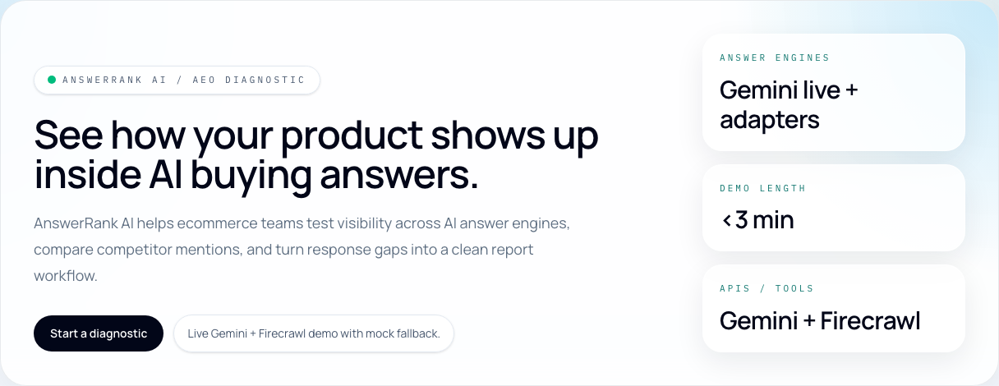
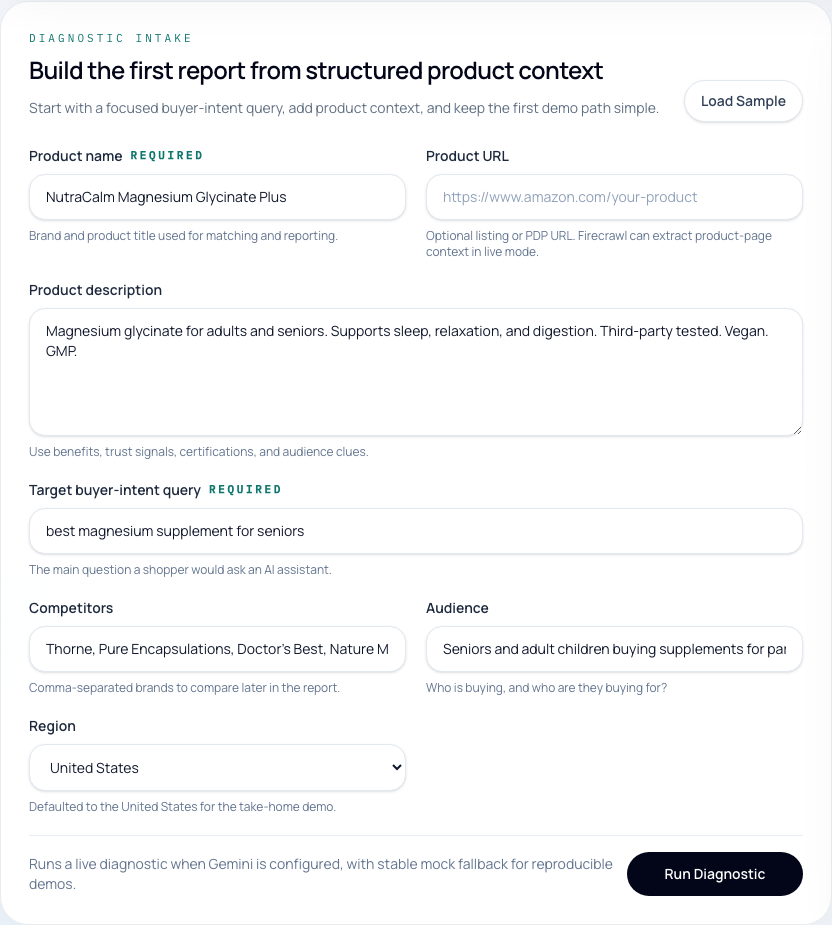
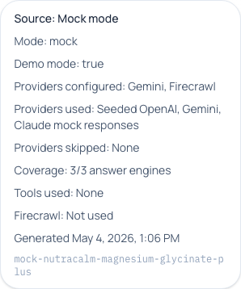
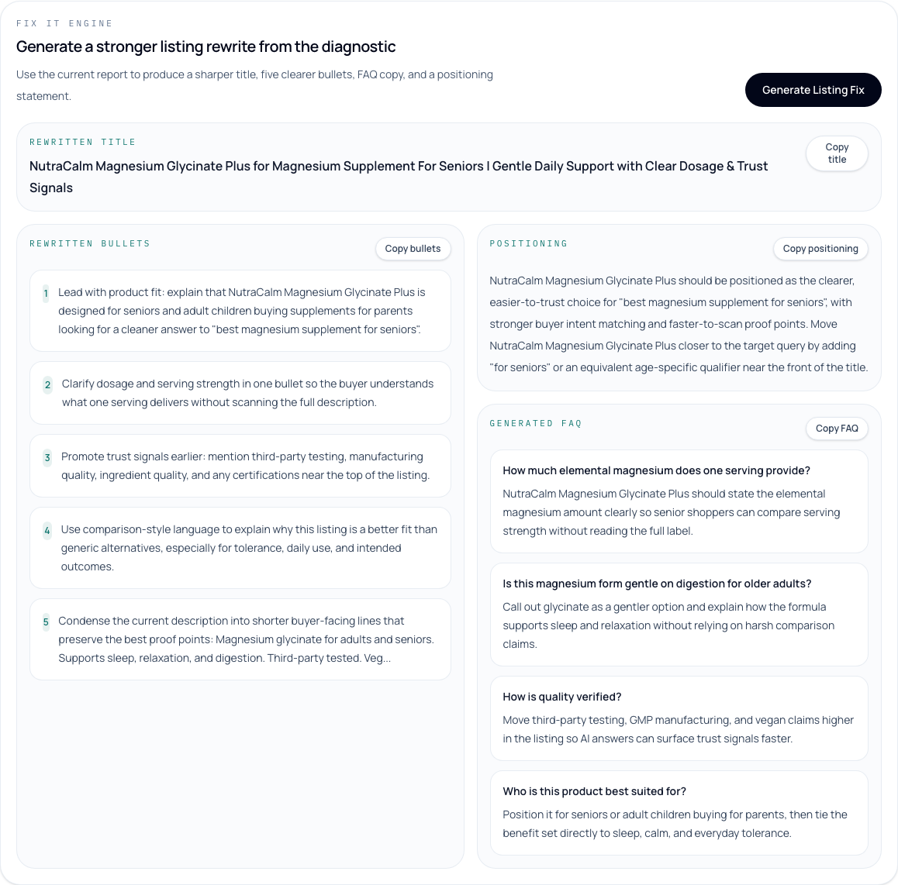
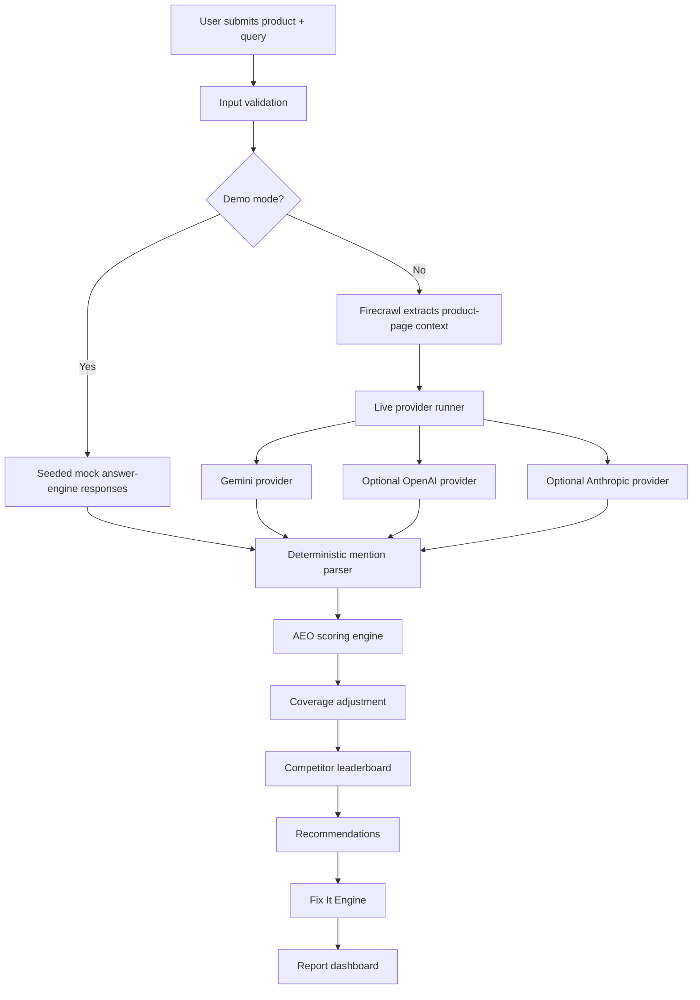
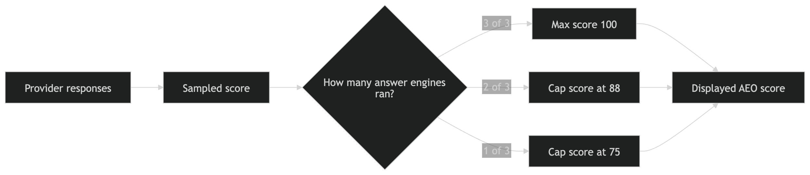

# AnswerRank AI


AnswerRank AI shows ecommerce brands how their products appear inside AI buying answers, who outranks them, and what to change.

## Why this exists

Customers are starting to ask AI assistants what to buy.

Brands already optimize for Google, Amazon, and social distribution, but most still have no clear view into whether AI answer engines mention them, ignore them, or recommend a competitor instead.

AnswerRank AI turns that visibility problem into a structured diagnostic report: what the answer engine said, where the product ranked, which brands won, how confident the result is, and what to fix in the listing next.

## What it does

- Accepts product name, product URL, product description, target buyer query, competitors, audience, and region
- Extracts product-page context with Firecrawl when a URL is available
- Queries Gemini live as the default answer-engine provider
- Supports optional OpenAI and Anthropic adapters that activate automatically when keys are present
- Parses product and competitor mentions deterministically
- Detects ranking position across provider responses
- Scores AI visibility with provider-coverage adjustment
- Builds a competitor leaderboard
- Generates listing recommendations
- Generates rewrites with the Fix It Engine

## Screenshots







## Demo modes

### Mock mode

Stable seeded OpenAI/Gemini/Claude-style responses.

This is the safest path for reproducible demos, reviewer testing, and screenshot capture. It keeps report output stable even when no external keys are available.

### Live mode

Gemini runs live.

Firecrawl extracts product-page context when a product URL is provided.

OpenAI and Anthropic adapters are implemented as optional providers and activate automatically when valid keys are added later. Missing optional keys are skipped gracefully.

## APIs / tools used

This project satisfies the take-home requirement of using 2+ APIs/tools beyond the AI coding assistant:

1. Gemini API  
   Used for live answer-engine generation.

2. Firecrawl API  
   Used for extracting product-page context from submitted URLs.

Internal tools:

- Deterministic parser
- AEO scoring engine
- Coverage-adjusted scoring
- Competitor leaderboard builder
- Fix It Engine

OpenAI and Anthropic are implemented as optional adapters. They are not required for the main live demo path and are skipped cleanly when keys are absent.

## Architecture



### Coverage adjustment

Single-provider live runs should not pretend to represent the full AI answer surface.

AnswerRank keeps the sampled score from the raw provider output, then caps the displayed score when fewer than 3 planned answer engines are available.



## Getting started

```bash
npm install
npm run dev
```

Open [http://localhost:3000](http://localhost:3000).

## Environment

Copy `.env.example` to `.env` and fill the keys you need.

### Mock mode

```bash
NEXT_PUBLIC_DEMO_MODE=true
GEMINI_API_KEY=
FIRECRAWL_API_KEY=
OPENAI_API_KEY=
ANTHROPIC_API_KEY=
```

### Gemini + Firecrawl live mode

```bash
NEXT_PUBLIC_DEMO_MODE=false
GEMINI_API_KEY=your_key
FIRECRAWL_API_KEY=your_key
OPENAI_API_KEY=
ANTHROPIC_API_KEY=
```

### Full 3-provider live mode

```bash
NEXT_PUBLIC_DEMO_MODE=false
GEMINI_API_KEY=your_key
OPENAI_API_KEY=your_key
ANTHROPIC_API_KEY=your_key
FIRECRAWL_API_KEY=your_key
```

Adding valid OpenAI and Anthropic keys later automatically expands the live run to full 3-provider coverage without code changes.

## Deploying on Vercel

AnswerRank AI is Vercel-ready as a standard Next.js App Router deployment. No database, auth setup, background jobs, or extra infrastructure is required.

### Recommended reviewer deployment

For stable reviewer testing, deploy with:

```bash
NEXT_PUBLIC_DEMO_MODE=true
```

This guarantees the app renders a complete deterministic mock report without depending on live provider credits or third-party API availability.

### Live Gemini + Firecrawl deployment

For live mode, set these Vercel Environment Variables:

```bash
NEXT_PUBLIC_DEMO_MODE=false
GEMINI_API_KEY=your_gemini_key
FIRECRAWL_API_KEY=your_firecrawl_key
OPENAI_API_KEY=
ANTHROPIC_API_KEY=
```

Notes:

- Gemini runs as the live answer engine
- Firecrawl extracts product-page context when a product URL is provided
- OpenAI and Anthropic are skipped gracefully if their keys are empty
- Coverage adjustment caps the displayed score when fewer than 3 answer engines run

### Full provider deployment

To enable full 3-provider live mode, add:

```bash
OPENAI_API_KEY=your_openai_key
ANTHROPIC_API_KEY=your_anthropic_key
```

With all provider keys configured:

- Gemini, OpenAI, and Anthropic run live
- Coverage becomes `3/3`
- `coverageAdjusted` becomes `false`
- `sampledScore` and `overallScore` should match unless another intentional scoring rule applies

## Screenshot automation

README screenshots are generated with Playwright Chromium.

```bash
npm install
npx playwright install chromium
NEXT_PUBLIC_DEMO_MODE=true npm run dev
npm run screenshots
```

Notes:

- The script expects an already-running local app at `http://localhost:3000`
- For stable README assets, run the app in mock mode before capturing
- Screenshots are saved to `public/screenshots`
- If capture fails, the script cleans up temp output instead of leaving partial assets behind

## Validation

```bash
npm run lint
npm run build
```

## Deployment checklist

Before deploying:

- Run `npm run lint`
- Run `npm run build`
- Confirm `.env.local` is not committed
- Confirm `.env.example` is committed
- Confirm screenshots are present under `public/screenshots`
- Confirm README screenshot links render correctly on GitHub

After deploying:

- Open the deployed URL
- Run a mock diagnostic if `NEXT_PUBLIC_DEMO_MODE=true`
- Confirm the report renders
- Confirm the Fix It Engine works
- Check Vercel function logs if live mode fails

## Current scope

This repo intentionally stays focused on the take-home MVP:

- No auth
- No billing
- No server-side database
- No streaming response UI
- No scheduled tracking jobs

## Deferred v2 features

- Streaming responses
- Query expansion
- Scheduled tracking
- Shopify/Amazon listing update workflows
