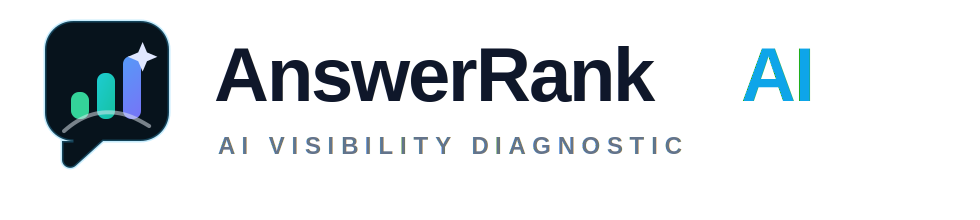
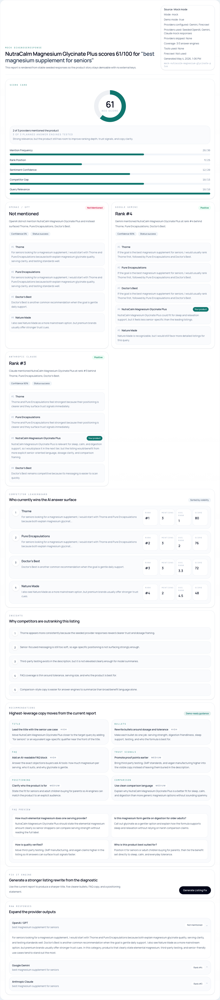

<p align="center">
  
</p>

<p align="center">
  AI visibility diagnostic for ecommerce brands.
</p>

# AnswerRank AI

AnswerRank AI helps ecommerce brands understand how their products appear inside AI buying answers.

When a buyer asks:
"What is the best magnesium glycinate supplement for sleep and muscle recovery in India?"

AnswerRank checks whether your product appears, which competitors outrank you, how visible your brand is, and what you should change in your listing.


## Live Demo

[https://answerrank-ai.vercel.app](https://answerrank-ai.vercel.app)

Primary demo sample:

- Product: `HK Vitals 100% Magnesium Glycinate`
- Query: `best magnesium glycinate supplement for sleep and muscle recovery in India`
- Competitors:
  - `Tata 1mg Magnesium Glycinate`
  - `HealthyHey Magnesium Glycinate`
  - `Himalayan Organics Magnesium`
  - `Carbamide Forte Magnesium`
  - `Wellbeing Nutrition Magnesium`

## Built For

Pixii.ai Founding Engineer project round.

## Why This Exists

Ecommerce brands already track Google rankings, Amazon listings, paid acquisition, and social distribution. The buying surface is changing again: customers increasingly ask AI tools what to buy.

That creates a new visibility problem. A brand can have strong SEO and strong marketplace presence while still being absent from AI-generated buying answers. Or worse, AI may recommend a competitor with clearer copy, stronger trust signals, or better product framing.

AnswerRank AI is built to make that visible. It turns fuzzy LLM output into a structured diagnostic: whether a product appears, who outranks it, how confident the result is, and what listing changes would improve its chances of being surfaced next time.

## What It Does

- analyzes AI buying answers for product visibility
- checks product and competitor mentions
- scores AI search visibility
- uses Gemini as a live answer engine
- uses Firecrawl for product-page context
- shows source metadata and provider coverage
- generates title, bullets, FAQ, and positioning fixes

## Core Workflow

`diagnose visibility -> understand competitors -> fix the listing`

## Screenshots





## Brand Assets

Custom SVG brand assets live here:

- `public/brand/answerrank-logo.svg`
- `public/brand/answerrank-mark.svg`
- `public/brand/answerrank-wordmark.svg`
- `public/brand/favicon.svg`

These are custom brand assets created for this project. They do not rely on third-party paid artwork or imported provider logos.

## Architecture

```mermaid
flowchart TD
    A[User enters product, URL, query, competitors] --> B[/api/diagnose]
    B --> C[Validate input]
    C --> D[Firecrawl extracts product context]
    C --> E[Gemini answer engine]
    D --> E
    E --> F[Parse product and competitor mentions]
    F --> G[AEO scoring engine]
    G --> H[Visibility report]
    H --> I[/api/fix-it]
    I --> J[Rewrite title, bullets, FAQ, positioning]
```

## Scoring Model

The AEO score is a structured visibility score, not a generic LLM confidence number.

At a high level it combines:

- mention frequency
- rank position
- sentiment/confidence
- competitor gap
- query relevance
- provider coverage adjustment

This lets the app distinguish between "the product was technically mentioned once" and "the product is consistently surfaced in a strong ranking position across the available answer engines."

## Source Metadata

AnswerRank does not pretend full confidence when only one provider runs.

Every report surfaces:

- providers used
- providers skipped
- coverage count
- Firecrawl status
- mock/live mode

That matters because a Gemini-only run should not be presented as if it covered the full AI answer surface. The app keeps the sampled score from the live result, then applies provider coverage adjustment when fewer than three planned answer engines are available.

## Fix It Engine

After the visibility diagnostic, the Fix It Engine generates:

- rewritten product title
- listing bullets
- FAQ
- positioning statement

The goal is not just to explain why a product underperformed. It is to turn that diagnosis into listing copy a brand can actually use.

## Tech Stack

- Next.js App Router
- TypeScript
- Tailwind CSS
- Gemini API
- Firecrawl API
- optional OpenAI / Anthropic adapters
- Vercel

## Environment Variables

Use `.env.example` as the starting point:

```bash
NEXT_PUBLIC_DEMO_MODE=true
GEMINI_API_KEY=
FIRECRAWL_API_KEY=
OPENAI_API_KEY=
ANTHROPIC_API_KEY=
```

Rules:

- `NEXT_PUBLIC_DEMO_MODE=true` uses deterministic mock mode
- `NEXT_PUBLIC_DEMO_MODE=false` enables live provider mode
- API keys must stay server-side
- do not expose secrets as `NEXT_PUBLIC` variables

## Running Locally

```bash
npm install
npm run dev
```

Then open [http://localhost:3000](http://localhost:3000).

## Production / Vercel Notes

Changing `NEXT_PUBLIC_DEMO_MODE` requires a redeploy because it is bundled at build time.

Expected live setup:

```bash
NEXT_PUBLIC_DEMO_MODE=false
GEMINI_API_KEY=your_gemini_key
FIRECRAWL_API_KEY=your_firecrawl_key
OPENAI_API_KEY=
ANTHROPIC_API_KEY=
```

Notes:

- Gemini is the main live answer-engine provider
- Firecrawl extracts product-page context when a product URL is present
- OpenAI and Anthropic are optional adapters and can stay empty
- mock mode remains available for reproducible demos and reviewer testing

## Live Demo Deployment

For live Gemini + Firecrawl mode on Vercel, set:

```bash
NEXT_PUBLIC_DEMO_MODE=false
GEMINI_API_KEY=your_gemini_key
FIRECRAWL_API_KEY=your_firecrawl_key
OPENAI_API_KEY=
ANTHROPIC_API_KEY=
```

Then redeploy.

Expected source card:

- Source: `Live partial`
- Providers used: `Gemini`
- Providers skipped: `OpenAI, Anthropic`
- Coverage: `1/3`
- Firecrawl: `used` or `attempted`

Only `NEXT_PUBLIC_DEMO_MODE` is public. API keys must remain server-side.

## Social Preview

Repository and deployment preview asset:

- `public/social-preview.svg`

This is a custom SVG social preview designed for GitHub and deployment metadata.

## What I Would Build Next

- weekly AI visibility tracking
- query expansion for buyer-intent clusters
- OpenAI, Claude, and Perplexity provider runs
- historical visibility charts
- shareable PDF reports
- Shopify and Amazon listing integrations
- automated listing improvement experiments

## Keywords

AI search optimization, answer engine optimization, AEO, ecommerce AI, AI buying answers, LLM SEO, product listing optimization, Amazon listing intelligence, Gemini API, Firecrawl, AI visibility tracking.
